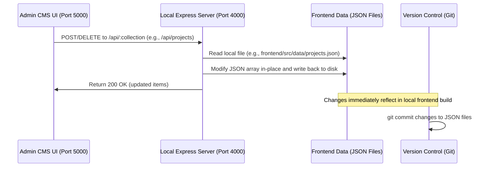

# Yadev Jayachandran — Developer Portfolio & CMS

Welcome to the source repository for **[yadev.cc](https://yadev.cc)**, a premium developer portfolio showcasing high-performance 3D graphics, smooth user experiences, and interactive Neumorphic control panels.

This project features a dual-mode layout:
1. **Classic Mode**: A polished, modern, tactile Neumorphic/Glassmorphic dashboard.
2. **Hyper Mode**: A high-intensity, fully interactive 3D WebGL scene powered by React Three Fiber, GSAP, and custom warp-speed camera rig transitions.

---

## 🏗️ Project Architecture

The codebase is split into three main components to separate public presentation from content editing:

```
├── frontend/               # React + Vite web application (main portfolio)
├── local-admin/            # Local Content Management Suite (CMS)
│   ├── server/             # Express local API server (Mock Database)
│   └── ui/                 # React + Tailwind CMS user interface
└── backend/                # Cloudflare Worker code for edge deployment
```

---

## 🛠️ The "No-DB" Admin System (Local CMS)

To keep the portfolio extremely fast, zero-maintenance, and cost-effective to host, it utilizes a **"No-DB" architecture** for content updates. 

Rather than deploying a traditional database (like MongoDB or PostgreSQL) and writing complex sync mechanisms or paying cloud hosting costs, the CMS edits the static content directly on your local disk.

### How it Works



### Key Components

1. **The JSON Datastore**:
   All database collections reside inside [frontend/src/data](file:///Users/yadevjayachandran/Antigravity/git/portfolio/frontend/src/data) as simple, git-tracked JSON arrays:
   - `projects.json`: Case studies, technology stacks, and external links.
   - `skills.json`: Core technical proficiencies.
   - `career.json`: Professional history and milestones.
   - `writing.json`: Blog posts and technical articles.

2. **The Local Server (`local-admin/server`)**:
   An Express server running on port `4000` that exposes standard REST routes (`GET`, `POST`, `DELETE`) mapping to file reads and writes on the JSON datastore.
   - It assigns unique timestamps as IDs (`Date.now().toString()`) when creating new documents.
   - It manages file uploads via **Multer**, storing portfolio media assets directly into the frontend public assets folder: `frontend/public/uploads`.

3. **The CMS Client (`local-admin/ui`)**:
   A lightweight, clean React dashboard running on port `5000` that allows you to easily write blog posts, add projects, update career timelines, and upload images.

### Advantages of this Workflow

> [!TIP]
> **Static Hosting**: Since the frontend references local JSON files and public images, the built site is 100% static. It can be hosted for free on Cloudflare Pages, Vercel, or Netlify.
>
> **Git as the Source of Truth**: All content updates are represented as diffs in Git. Your blog posts and projects are version-controlled alongside your code.
>
> **No Cold Starts**: There are no database server cold starts, connection pool limits, or latency overhead when users visit the site.
>
> **Local First**: Edit all content offline with a visual dashboard, preview it in real-time, and deploy updates via a simple `git push`.

---

## 🚀 Getting Started (Local Development)

The project includes pre-configured run scripts to start all three services simultaneously.

### Automatic Startup

Double-click the script corresponding to your operating system, or run it in your terminal from the root folder:

- **macOS**:
  ```bash
  chmod +x start-mac.command
  ./start-mac.command
  ```
- **Linux**:
  ```bash
  chmod +x start-linux.sh
  ./start-linux.sh
  ```
- **Windows**:
  ```cmd
  start-windows.bat
  ```

This will run the local API server, the Admin UI, and the Frontend dev server, and automatically launch `http://localhost:5173` in your default browser.

### Manual Startup

If you prefer to start services individually, run these commands in separate terminal windows:

1. **Start the API Server**:
   ```bash
   cd local-admin/server
   npm install
   node index.js
   ```
2. **Start the CMS Dashboard**:
   ```bash
   cd local-admin/ui
   npm install
   npm run dev
   ```
3. **Start the Portfolio Frontend**:
   ```bash
   cd frontend
   npm install
   npm run dev
   ```

---

## 🚀 Deploying to Production

When you are ready to publish changes:

1. Run the local CMS and make your edits (add projects, write blogs, upload images).
2. Stop the local CMS and stage the updated files in Git:
   ```bash
   git add frontend/src/data/ frontend/public/uploads/
   git commit -m "content: add new project and write blog post"
   git push origin main
   ```
3. Your static hosting provider (e.g. Cloudflare Pages) will automatically detect the commit, build the frontend (`npm run build`), and deploy the changes globally.
